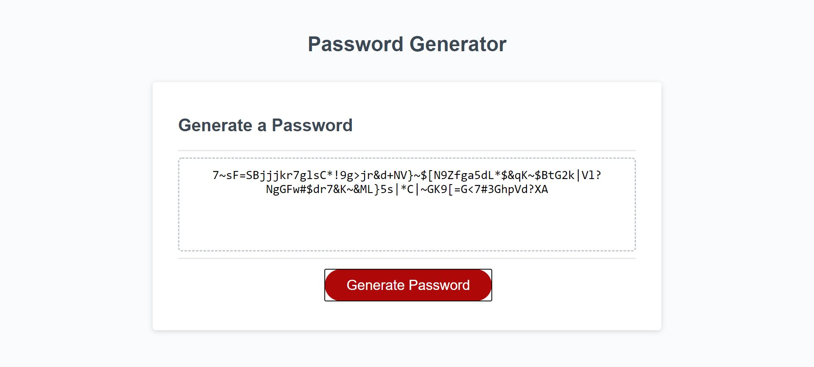

# Jonathan Gilbert Week 3 Homework - Password Generation
# UNH-POR-FSF-PT-09-2020-U-C
## File Name: 03-JavaScriptPWGen
## GitHub Repo
Link: https://github.com/JGilb28-7/03-JavaScriptPWGen.git

The application for week three password generation homework completes the random password return based on the length input and the selections for charatcter.

User's input is validated to meet client-specified requirements:
Password length (8-128 characters)

Must select at least one character type (lowercase, uppercase, numeric, or special characters

I used the Master and the basecode as a refernce point that was provided

used let instead of var

 